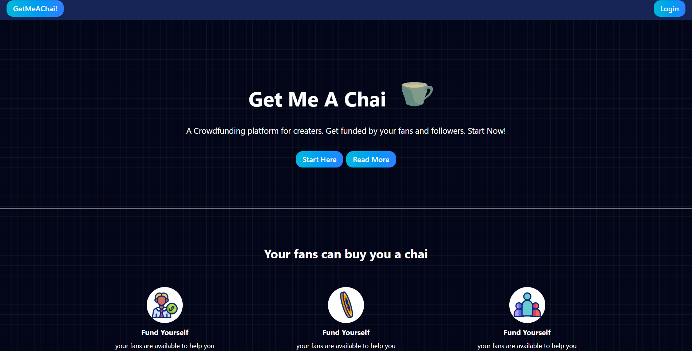
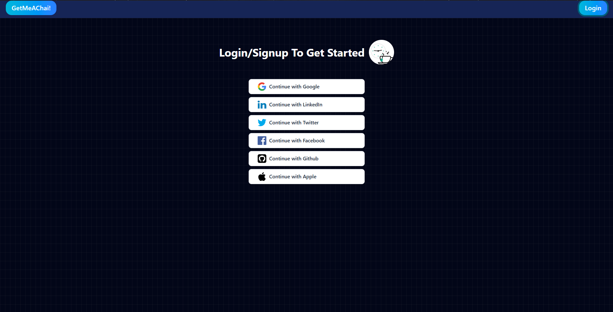
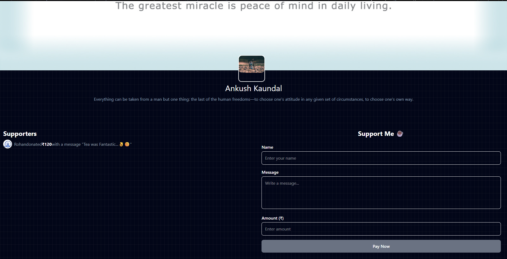
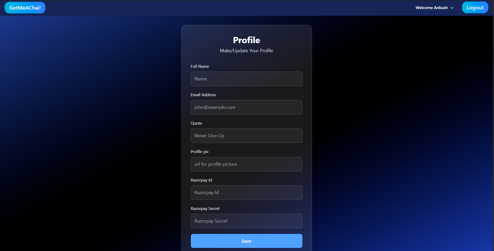
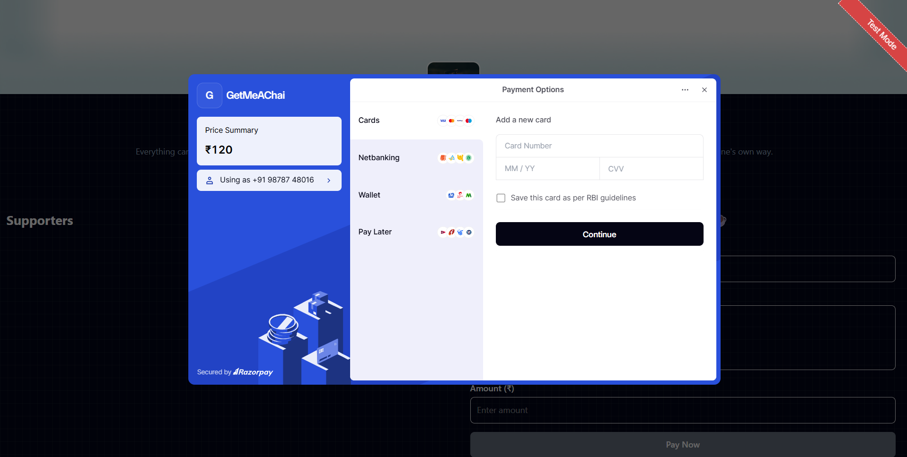

# GetMeAChai ☕

GetMeAChai is my first full-stack web application built using Next.js, MongoDB, Tailwind CSS, and NextAuth.

The project is inspired by creator-support platforms where users can create profiles and receive support from others. The primary goal of this project was to gain hands-on experience with full-stack development, authentication, database management, and building a complete web application from scratch.

---

## Features

* Authentication using GitHub and Google OAuth
* User profile pages
* Dynamic routing with Next.js
* Session management using NextAuth
* MongoDB database integration
* Responsive UI built with Tailwind CSS
* Contact page and additional static pages
* Basic payment gateway integration

---
## Screenshots

### Home Page


### Login Page


### Profile Page


### Dashboard


### Payment Page


## Tech Stack

### Frontend

* Next.js
* React
* Tailwind CSS

### Backend

* Next.js API Routes

### Database

* MongoDB

### Authentication

* NextAuth
* GitHub OAuth
* Google OAuth

### Payments

* Razorpay Integration

---

## What I Learned

Building this project helped me learn:

* Authentication and OAuth workflows
* Session handling with NextAuth
* Database operations using MongoDB
* Dynamic routing in Next.js
* State management in React
* Creating reusable components
* API route development
* Handling forms and user interactions
* Debugging real-world development issues
* Organizing and maintaining a full-stack project structure

---

## Challenges Faced

Some challenges encountered during development included:

* Configuring GitHub and Google authentication
* Managing environment variables securely
* Working with user sessions
* Handling routing and navigation issues
* Integrating payment functionality
* Building responsive layouts with Tailwind CSS
* Debugging application errors and edge cases

These challenges provided valuable practical experience and improved my understanding of full-stack application development.

---

## Current Limitations

This project was built primarily as a learning project and is not intended for production use.

Current limitations include:

* Payment signature verification is not yet implemented
* Payment security flow can be improved further
* Additional validation and error handling can be added
* UI/UX can be refined further

---

## Future Improvements

Planned improvements include:

* Payment signature verification and secure payment confirmation
* Improved dashboard functionality
* Better profile customization options
* Enhanced user experience and design
* Notification system
* Additional account management features

---

## Installation

Clone the repository:

```bash
git clone <repository-url>
```

Install dependencies:

```bash
npm install
```

Run the development server:

```bash
npm run dev
```

Open:

```bash
http://localhost:3000
```

---

## Author

Ankush Kaundal

This project represents my first complete full-stack application and an important milestone in my journey as a web developer.
